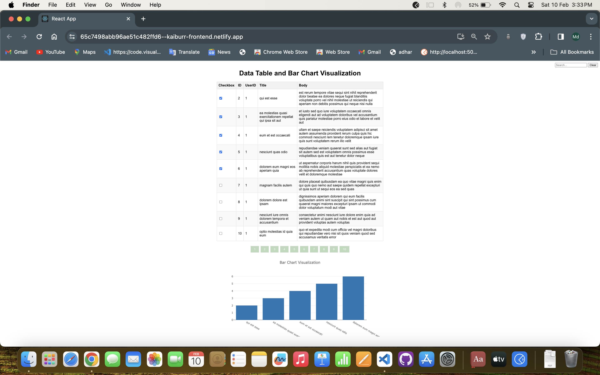

# Single Page Application with Data Table and Bar Chart Visualization

This web application is built using ReactJS and includes a data table and a bar chart visualization. Users can interact with the data table and dynamically update the bar chart based on the selected rows.

## Features

1. **Data Table**: Implemented with several columns, including at least 2 string value columns and 2 numeric value columns. Each table row has a checkbox as the first cell.
2. **Initial Checkbox State**: Initially, only the first 5 row checkboxes in the data table are checked.
3. **Bar Chart Visualization**: Utilizes Plotly.js library to create a bar chart visualization. Displays the values of one of the numeric columns of the checked data table rows as bars in the chart.
4. **Real-time Updates**: When a checkbox in the data table is unchecked, the corresponding data is removed from the chart, and the chart updates in real-time as checkboxes are checked or unchecked.
5. **Lazy Loading of Data**: Data is fetched from a backend service with lazy loading implemented. Only the data being displayed in the table is fetched, preventing unnecessary API calls.
6. **Pagination and Search Bar**: Ability to fetch at least 100 rows of data. Pagination and a search bar are implemented to filter the data in the table, enhancing usability.
7. **Layout and Visual Design**: Designed with a layout and visual design suited to this type of application, contributing to overall user experience.

## Technologies Used
ReactJS
Plotly.js
HTML
CSS

## Usage
Upon opening the application, users will see the data table with checkboxes and the initial bar chart visualization.
Users can interact with the data table by checking or unchecking checkboxes.
The bar chart will update in real-time based on the selected rows in the data table.
Pagination and search functionality allow users to filter and navigate through the data effectively.

## Screenshots
